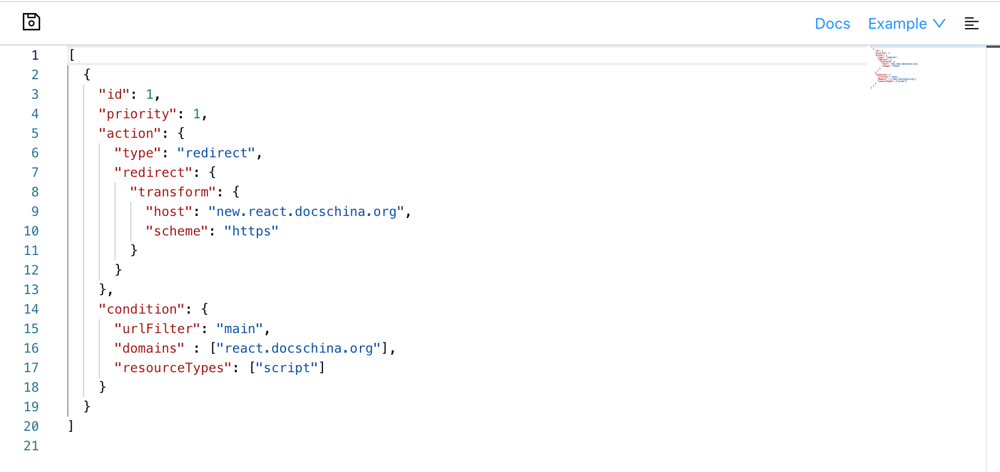
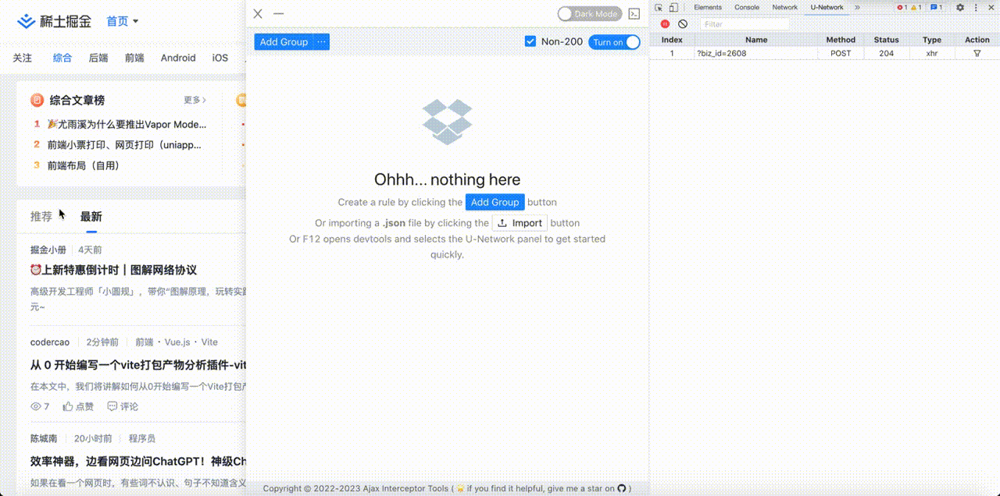
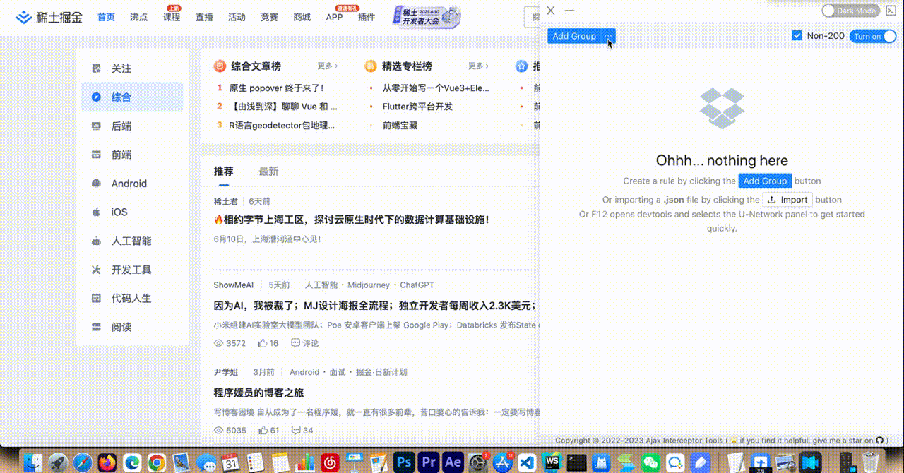
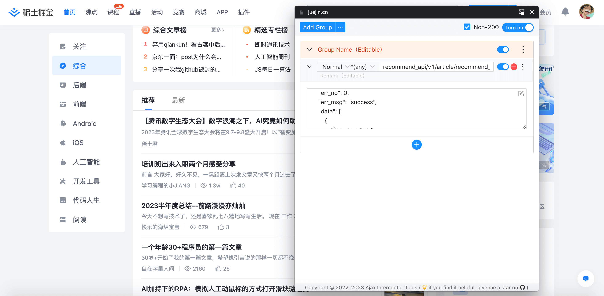

[English](./README.md) | 简体中文

  

[](https://chrome.google.com/webstore/detail/ajax-interceptor-tools/kphegobalneikdjnboeiheiklpbbhncm)
[](https://chrome.google.com/webstore/detail/ajax-interceptor-tools/kphegobalneikdjnboeiheiklpbbhncm)   
一个修改Ajax请求响应结果的Chrome扩展插件。  

**主要功能：**   
- [x] 支持拦截并修改XMLHttpRequest和fetch请求的响应结果，包括404状态的请求
- [x] 支持基于正则表达式和HTTP请求方法匹配请求
- [x] 支持以JSON或JavaScript格式编辑响应结果（支持使用Mock.js语法）
- [x] 支持在JavaScript编程中从arguments参数获取原始请求信息，轻松创建mock场景
- [x] 在DevTools中新增U-Network面板，快速实现请求拦截和响应结果修改
- [x] 支持更改请求的URL、请求头和请求体
- [x] 支持导入/导出规则配置
- [x] 支持调整分组及规则顺序
- [x] 新增画中画打开配置页面
- [x] 新增使用declarativeNetRequest拦截网络配置页面


## 安装
谷歌商店：https://chrome.google.com/webstore/detail/ajax-interceptor-tools/kphegobalneikdjnboeiheiklpbbhncm  
直接下载：https://raw.githubusercontent.com/PengChen96/ajax-tools/master/kphegobalneikdjnboeiheiklpbbhncm.crx

## 使用

<!--  -->

视频: [https://www.youtube.com/watch?v=HPtQO0Fyb7I](https://www.youtube.com/watch?v=HPtQO0Fyb7I)

### 一、修改Response响应结果
在Response编辑器中，您可以选择：  
1、使用JSON/JavaScript格式编辑响应结果  
2、转发原始响应结果（如果清空Response编辑器，将会把原始响应结果转发给应用程序）


#### 1、 使用JSON格式编辑响应结果
示例：
```
{
  "status": 200,
  "response": "OK"
}

```

#### 2、 使用JavaScript格式编辑响应结果
使用JS方式编辑响应结果时，通过`new Function(responseText)`生成函数并执行，响应结果即为函数的返回值。

##### 2.1. 简单JavaScript片段

示例：
```js
const data = [];
for (let i = 0; i < 10; i++) {
  data.push({ id: i });
}
return {
  "status": 200,
  "response": data
}
```
##### 2.2. 使用 [mock.js](https://github.com/nuysoft/Mock/wiki/Getting-Started) 生成随机数据
示例：
```js
const data = Mock.mock({
    // 属性 list 的值是一个数组，其中含有 1 到 10 个元素
    'list|1-10': [{
        // 属性 id 是一个自增数，起始值为 1，每次增 1
        'id|+1': 1
    }]
});
return {
  "status": 200,
  "response": data
}
```
将生成类似以下数据：
```
// ==>
{
    "list": [
        {
            "id": 1
        },
        {
            "id": 2
        },
        {
            "id": 3
        }
    ]
}
```

##### 2.3. 从arguments获取原始数据，简单编程创建场景 
   

示例： 
```js
let { method, payload, originalResponse } = arguments[0];
if (method === 'get') { // 请求方式
  // do something
}
if (payload) { // 入参 { queryStringParameters，requestPayload }
  // do something
}
return {
  "status": 200,
  "response": originalResponse
};
```

### 二、修改Request请求信息
在Request面板中，您可以选择修改请求URL、method、headers和payload。

#### 1. 修改请求URL和method
例下图中，将会把匹配到的`/auth/login`请求路径替换为`/auth/login2`，并把请求方法改为POST，您可以打开devtools在Network面板中看到替换后的请求。  
  

#### 2. 修改请求headers
例下图中，将会把请求headers中的`Content-Type`替换为`application/json`。
  

#### 3. 修改请求payload
例下图中，将会在入参中新增`test: test123`，您可以打开devtools在Network面板中看到请求体的修改。  
  

### 三、支持通过chrome.declarativeNetRequest使用指定声明性规则来阻止或修改网络请求  
  
#### 1. 阻止请求规则示例：
下面的规则将会阻止所有来自域名为“react.docschina.org”且 URL 中包含“main”子字符串的脚本请求
```js
[
  {
    "id" : 1,
    "priority": 1,
    "action" : { "type" : "block" },
    "condition" : {
      "urlFilter" : "main",
      "domains" : ["react.docschina.org"],
      "resourceTypes" : ["script"]
    }
  }
]
```
#### 2. 重定向请求规则示例：
下面的规则将会把所有来自域名为“react.docschina.org”且 URL 中包含“main”子字符串的脚本请求重定向到“new.react.docschina.org”
```js
[
  {
    "id": 1,
    "priority": 1,
    "action": {
      "type": "redirect",
      "redirect": {
        "transform": {
          "host": "new.react.docschina.org",
          "scheme": "https"
        }
      }
    },
    "condition": {
      "urlFilter": "main",
      "domains" : ["react.docschina.org"],
      "resourceTypes": ["script"]
    }
  }
]
```
#### 3. 完整配置
更多详细可查看文档
[declarativeNetRequest官方文档](https://developer.chrome.com/docs/extensions/reference/declarativeNetRequest/#build-rules)
[declarativeNetRequest中文文档](https://doc.yilijishu.info/chrome/declarativeNetRequest.html)
```js
[
  {
    // 唯一标识规则的 id。必填项，应为 >= 1
    "id": 1,
    // 规则优先级。默认值为 1。指定时，应为 >= 1
    "priority": 1,
    // 匹配此规则时要执行的操作
    "action": {
      // 要执行的操作的类型。 block、redirect、allow、upgradeScheme、modifyHeaders、allowAllRequests
      "type": "redirect",
      // 描述应如何执行重定向。仅对重定向规则有效。
      "redirect": {
        // 重定向网址。不允许重定向到 JavaScript 网址。
        "url": "",
        // 要执行的 URL 转换。
        "transform": {
          // 请求的新方案。允许的值是“http”，“https”，“ftp”和“chrome扩展名”。
          "scheme": "https",
          // 请求的新主机。
          "host": "new.react.docschina.org",
          // 请求的新路径。如果为空，则清除现有路径。
          "path": "",
          // 请求的新端口。如果为空，则清除现有端口。
          "port": "",
          // 请求的新片段。应为空，在这种情况下，将清除现有片段;或应以“#”开头。
          "fragment": "",
          // 请求的新查询。应为空，在这种情况下，将清除现有查询;或者应该以“？”开头。
          "query": "",
          // 添加、删除或替换查询键值对。
          "queryTransform": {
            // 要添加或替换的查询键值对的列表
            "addOrReplaceParams": [
              {
                "key": "",
                "value": "",
                // 如果为 true，则仅当查询键已存在时，才会替换查询键。否则，如果缺少密钥，也会添加密钥。默认为 false。
                "replaceOnly": false,
              }
            ],
            // 要删除的查询键的列表。
            "removeParams": []
          },
          // 请求的新用户名
          "username": "",
          // 请求的新密码。
          "password": "",
        },
        // 相对于扩展目录的路径。应以“/”开头。
        "extensionPath": "",
        // 对于指定了 regexFilter 的规则，使用此替换模式。在 URL 中，regexFilter 的第一个匹配项将被替换为此模式。在 regexSubstitution 内部，可以使用反斜杠转义的数字（\1 到 \9）来插入相应的捕获组。\0 指的是整个匹配文本。
        "regexSubstitution": ""
      },
      // 要为请求修改的请求标头。仅当 RuleActionType 为 “modifyHeaders” 时才有效。
      "requestHeaders": [
        {
          // 要修改的标头的名称。
          "header": "",
          // 要对标头执行的操作。 append、set、remove
          "operation": [""],
          // 标头的新值。必须为 和 set 操作 append 指定。
          "value": "",
        } 
      ],
      // 要为请求修改的响应标头。仅当 RuleActionType 为 “modifyHeaders” 时才有效。
      "responseHeaders": [
        {
          // 要修改的标头的名称。
          "header": "",
          // 要对标头执行的操作。 append、set、remove
          "operation": [""],
          // 标头的新值。必须为 和 set 操作 append 指定。
          "value": "",
        } 
      ],
    },
    // 触发此规则的条件
    "condition": {
      // 与网络请求 URL 匹配的模式
      "urlFilter": "main",
      // 与网络请求 URL 匹配的正则表达式。这遵循 RE2 语法。
      "regexFilter": "", // 注： 只能指定 or regexFilter 中的一个 urlFilter 。
      // 该规则将仅匹配源自 列表 domains 的网络请求。 自 Chrome 101 起已弃用，改用 initiatorDomains
      "domains" : ["react.docschina.org"],
      // 【new】Chrome 101+ 该规则将仅匹配源自 列表 initiatorDomains 的网络请求。如果省略该列表，则该规则将应用于来自所有域的请求。不允许使用空列表。
      "initiatorDomains" : ["react.docschina.org"],
      // 该规则将不匹配源自列表 excludedDomains 的网络请求。 自 Chrome 101 起已弃用，改用 excludedInitiatorDomains
      "excludedDomains" : [""],
      // 【new】Chrome 101+ 该规则将不匹配源自 列表 excludedInitiatorDomains 的网络请求。如果列表为空或省略，则不排除任何域。这优先于 initiatorDomains 。
      "excludedInitiatorDomains": [""],
      // 规则可以匹配的资源类型列表。不允许使用空列表。
      "resourceTypes": ["script"],
      // 指定网络请求是其来源域的第一方还是第三方。如果省略，则接受所有请求。 firstParty、thirdParty
      "domainType": "",
      // 规则不匹配的请求方法列表。仅应指定 和 excludedRequestMethods 中的一个 requestMethods 。如果未指定它们，则匹配所有请求方法。
      "excludedRequestMethods": "", // "connect"、"delete"、"get"、"head"、"options"、"patch" 、"post"、"put"、"other"
      // 规则不匹配的资源类型列表。仅应指定 和 excludedResourceTypes 中的一个 resourceTypes 。如果未指定它们，则将阻止除“main_frame”之外的所有资源类型。
      "excludedResourceTypes": "", // "main_frame"、"sub_frame"、"stylesheet"、"script"、"image"、"font"、"object"、"xmlhttprequest"、"ping"、"csp_report"、"media"、"websocket"、"webtransport"、"webbundle"、"other"
      // 规则应匹配 tabs.Tab.id 的列表。匹配不是源自选项卡的请求的 tabs.TAB_ID_NONE ID。不允许使用空列表。仅会话范围的规则受支持。      
      "tabIds": [],
      // 规则不应匹配 tabs.Tab.id 的列表。的 tabs.TAB_ID_NONE ID 排除不是源自选项卡的请求。仅会话范围的规则受支持。  
      "excludedTabIds": [],
      // urlFilter 或 regexFilter （以指定者为准）是否区分大小写。默认值为 true。
      "isUrlFilterCaseSensitive": true,
      // 仅当域与 列表中的 requestDomains 网络请求匹配时，该规则才会匹配网络请求。如果省略该列表，则该规则将应用于来自所有域的请求。不允许使用空列表。
      "requestDomains": [],
      // 规则可以匹配的 HTTP 请求方法列表。不允许使用空列表。
      "requestMethods": [], // 注意：指定 requestMethods 规则条件也会排除非 HTTP（s） 请求，而指定 excludedRequestMethods 则不会。
    }
  }
]
```

### 四、快速添加请求进行修改


### 五、支持导入/导出规则配置


### 六、文档画中画


## License
MIT License.
