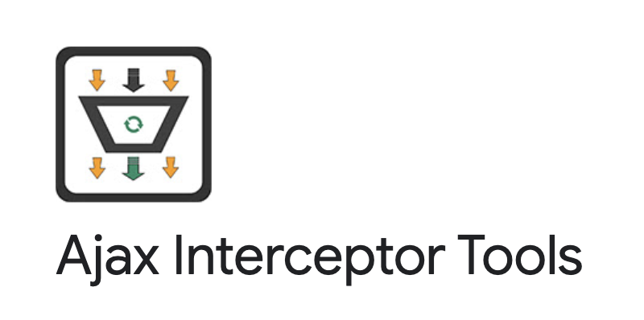

English | [简体中文](./README-zh.md)

  

[](https://chrome.google.com/webstore/detail/ajax-interceptor-tools/kphegobalneikdjnboeiheiklpbbhncm)   
An extension plugin for Chrome that modifies the response of AJAX requests. 

**Main features:**   
- [x] Intercept and modify the response of XMLHttpRequest and fetch requests, including 404 status requests.
- [x] Match requests based on regular expressions and HTTP request methods.
- [x] Edit response results in JSON or JavaScript format, with support for mock.js syntax.
- [x] Easily create mock scenarios in JavaScript programming by accessing original request information from the arguments parameter.
- [x] New U-Network panel in DevTools for quickly intercepting requests and modifying response results [added in version 0.0.4].

## Install
https://chrome.google.com/webstore/detail/ajax-interceptor-tools/kphegobalneikdjnboeiheiklpbbhncm  

## Usage
  
  

Video: [https://www.youtube.com/watch?v=HPtQO0Fyb7I](https://www.youtube.com/watch?v=HPtQO0Fyb7I)

### Edit response results using JavaScript
When editing the response results using JavaScript, a function is generated and executed via new Function(responseText), and the returned result is the return value of the function.

Example：
```js
const data = [];
for (let i = 0; i < 10; i++) {
  data.push({ id: i });
}
return {
  data
}
```
**Support for [Mock.js](https://github.com/nuysoft/Mock/wiki/Getting-Started) syntax**

Example：
```js
const data = Mock.mock({
    // The value of the property "list" is an array that contains 1 to 10 elements.
    'list|1-10': [{
        // The property "id" is an auto-incremented number starting from 1 and increasing by 1 each time.
        'id|+1': 1
    }]
});
return {
  data
}
```

**Retrieve original request information through the arguments parameter and easily create mock scenarios using simple programming**
  
Example：
```js
let { method, payload, originalResponse } = arguments[0];
if (method === 'get') { // Method
  // do something
}
if (payload) { // parameters { queryStringParameters，requestPayload }
  // do something
}
return originalResponse;
```

## License
MIT License.
